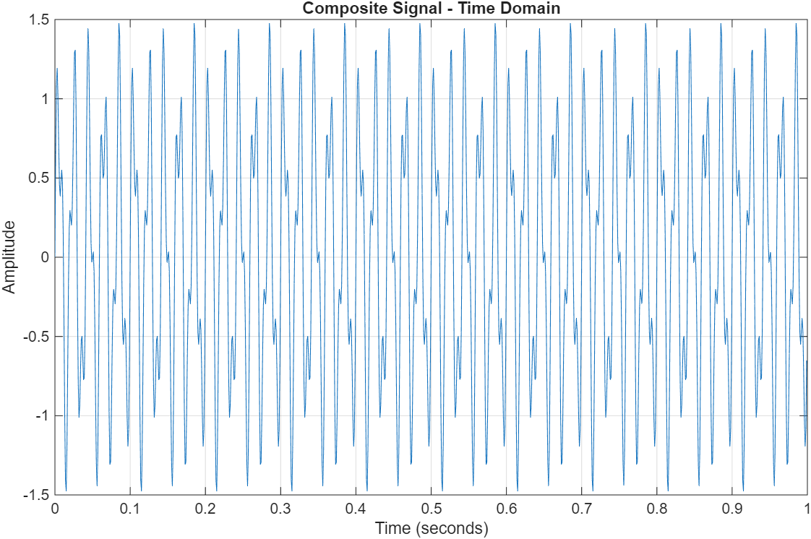
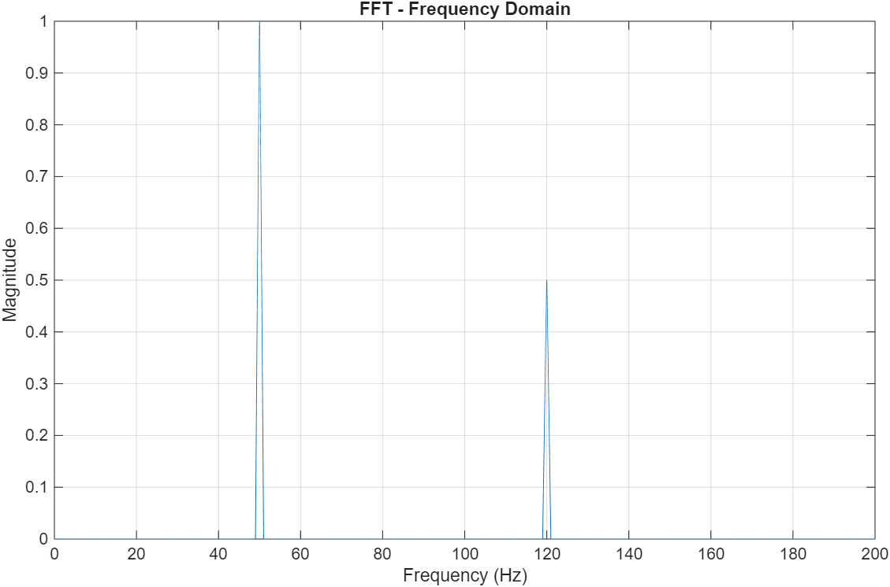

# MATLAB DSP Projects

This repository contains MATLAB implementations of fundamental Digital Signal Processing (DSP) concepts.

## Project 1: Signal Generation and FFT Analysis

### Objective

To generate a composite sinusoidal signal and analyze its frequency components using the Fast Fourier Transform (FFT).

### Signal

The composite signal consists of two sinusoidal components:

- Frequency 1: 50 Hz
- Frequency 2: 120 Hz
- Sampling frequency: 1000 Hz

The signal is given by:

x(t) = sin(2π50t) + 0.5 sin(2π120t)

### Implementation

The MATLAB program:

1. Generates the composite signal.
2. Plots the signal in the time domain.
3. Calculates the FFT.
4. Converts the FFT into a single-sided magnitude spectrum.
5. Displays the frequency-domain spectrum.

### Results

The FFT spectrum shows two dominant frequency components:

- 50 Hz with magnitude approximately 1
- 120 Hz with magnitude approximately 0.5

### Output

#### Time Domain

#### Frequency Domain

## Tools Used

- MATLAB
- Fast Fourier Transform (FFT)
- Digital Signal Processing

## Skills Demonstrated

- Signal generation
- Sampling
- Time-domain analysis
- Frequency-domain analysis
- FFT implementation
- MATLAB programming
